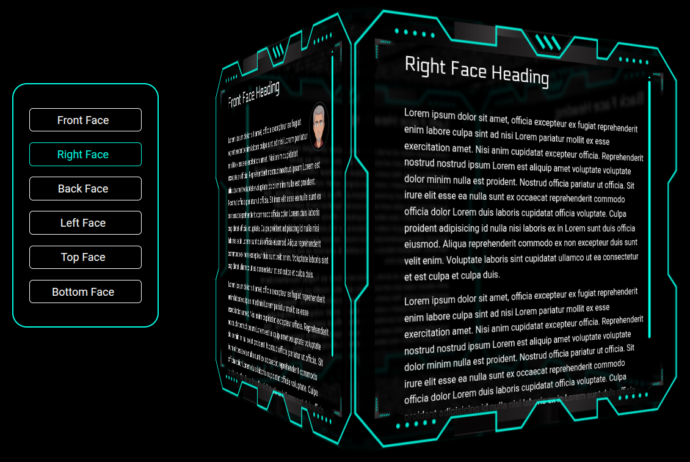

# 3D Cube UI

A 3D cube UI originally inspired by the Cube CV: 

https://codepen.io/l-ignatova/pen/qByExmV

You can see an online demo here:

https://cube.kendawson.online/

# Features

- rotating 3 dimensional cube UI for screen sizes above 750px wide
- smaller screen uses SwiperJS with cube effect
- user can swipe left/right to rotate cube effect on small screens
- content loaded separately from external data files
- persistance via local storage (remembers location on reload)
- deep linking via URL parameters (e.g. ?view=face5)
- fine-grained CSS adjustment for medium and large screen via media queries
- error notification alerts 
- supports iframes (with same-origin content)

